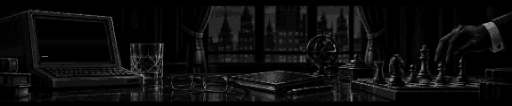

<picture>
  <source media="(prefers-reduced-motion: reduce)" srcset="assets/animations/pixel-noir-poster.png" />
  
</picture>

# Teo | Nexcore

**Web3 & AI Enthusiast · AR Developer · Independent Research**

[English](#english) · [Русский](#русский)

  
  

## English

I research artificial intelligence and Web3, build experimental AI projects, and develop applications for **Even G2** smart glasses. My focus is on new ways to interact with technology, from intelligent tools to augmented reality interfaces.

For me, research is the starting point for creating something new. I'm interested in taking promising ideas through purposeful experimentation and turning concepts into practical solutions.

My main focus is AI automation for businesses: document workflows, CRM integrations, and agent systems. I also have experience in systems administration, hardware, and product design. I've followed the crypto industry for around five years, including one year working in the field professionally.

### Focus

- **AI Research** — research, experiments, and projects in artificial intelligence.
- **AR Development** — applications for **Even G2** smart glasses and augmented reality interfaces.
- **Web3** — decentralized technologies and how they intersect with AI.
- **Emerging Tech** — new directions, unconventional hypotheses, and promising ideas.

---

## Русский

Исследую искусственный интеллект и Web3, развиваю экспериментальные AI-проекты и разрабатываю приложения для умных очков **Even G2**. Мой фокус — новые сценарии взаимодействия с технологиями: от интеллектуальных инструментов до интерфейсов дополненной реальности.

Для меня исследование — это отправная точка для создания нового. Меня интересует путь от перспективной идеи к осмысленному эксперименту и решениям, которые могут выйти за пределы концепции.

Основное направление моей работы — AI-автоматизация для бизнеса: документооборот, интеграции с CRM и агентские системы. Также есть опыт системного администрирования, работы с железом и дизайна продуктов. За криптоиндустрией слежу около пяти лет, один год работал в ней профессионально.

### В фокусе

- **AI Research** — исследования, эксперименты и проекты в сфере искусственного интеллекта.
- **AR Development** — разработка приложений для умных очков **Even G2** и работа с интерфейсами дополненной реальности.
- **Web3** — децентрализованные технологии и возможности их пересечения с AI.
- **Emerging Tech** — новые направления, нестандартные гипотезы и поиск перспективных идей.

---

## Stack & tools

  
  
  
  
  

  
  
  
  

## Open-source contributions

| Project / area | Change | Status |
| --- | --- | --- |
| **Hermes Agent** | Bug fixes across [Slack](https://github.com/NousResearch/hermes-agent/pull/111411), [MoA](https://github.com/NousResearch/hermes-agent/pull/111355), CLI, file tools, MCP, schema validation and streaming. | [14 PRs](https://github.com/pulls?q=is%3Apr%20author%3Ateo-nex%20repo%3ANousResearch%2Fhermes-agent%20repo%3Aliuhao1024%2Fhermes-agent%20-label%3Aduplicate) · **2 fixes merged upstream** |
| **CanvasTTY · Agent orchestration** | Added a native Codex control CLI and orchestration skill with YOLO support. | [Open PR](https://github.com/howdeploy/CanvasTTY/pull/32) |
| **CanvasTTY · Browser tools** | Replaced misleading empty browser results with an actionable viewport error. | [Merged upstream](https://github.com/howdeploy/CanvasTTY/pull/33) |
| **CanvasTTY · Parallel agents** | Added independent browser cards and per-agent ownership; corrected native resize, clipping and frozen-frame transitions. | [Open PR](https://github.com/howdeploy/CanvasTTY/pull/34) · [614 tests and 17/17 desktop CI jobs passed](https://github.com/teo-nex/CanvasTTY/actions/runs/34982053325) |
| **Pi · Prompt templates** | Prepared a tested fix that preserves literal arguments in prompt templates. | [Proposal submitted](https://github.com/earendil-works/pi/issues/9588) · [Prepared fix](https://github.com/teo-nex/pi/commit/8ca829a21fee2e47417c9c0ad0908eb17c924b1c) |

**CanvasTTY × Even G2 — full adaptation for smart glasses**

Adapted CanvasTTY for Even G2 glasses: terminal and AI-agent control through the glasses HUD, voice dictation with local Nemotron speech recognition, session creation, and six-digit local pairing. The integration includes CanvasTTY's desktop controls and the Even G2 companion app.

**Status:** [Open PR #50](https://github.com/howdeploy/CanvasTTY/pull/50) · [697 tests passed](https://github.com/howdeploy/CanvasTTY/actions/runs/34990681074/job/104454211022) (650 desktop + 47 companion) · Companion app approved for Even Hub.

*Statuses checked on 16 September 2026. Pi's proposal is auto-closed pending maintainer review.*

## Engineering notes

**[A passing filter test can still miss a routing regression](notes/slack-routing-tests.md)**  
A Hermes Agent case study: an assertion that could never fail, two dropped message types, and a 12-case test of the adapter's routing behavior.

 

<picture>
  <source media="(prefers-reduced-motion: reduce)" srcset="assets/animations/pixel-noir-footer-poster.png" />
  
</picture>
